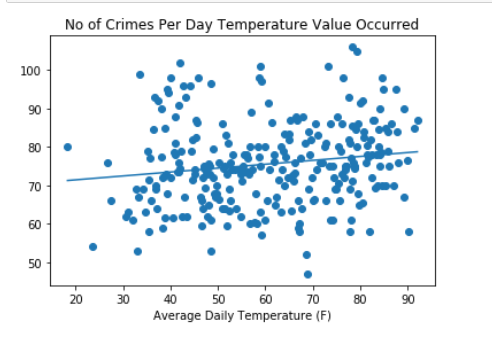
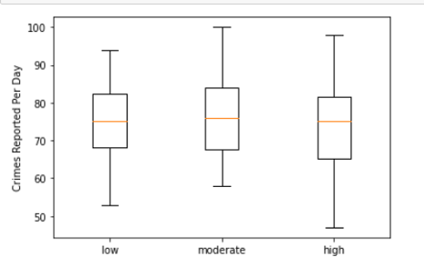

# Does Washington DC Weather Impact It’s Crime?
GWU – DATA ANALYSIS BOOTCAMP
Project One, Group 2
Group Members:  Vikas Agrawal, Yonatan Gorin, Desiree Joseph, Beth Wilde
February 15, 2023

##### Project Description/Outline
We will investigate how the trends in the District of Columbia (DC) crime data may be affected by weather. We will use crime and weather data for the period February 2022 through February 2023. The study will include checking if there is a correlation between weather and crime rate. We want to know how the different weather conditions impact crime.

##### Data Collection, Exploration, and Cleaning
Create DC crime pandas dataframe.
  import the .csv data
  examine the data
  identify columns that we need
  filter based on above criteria

Create weather pandas dataframe.
  Gather weather data from Weather API regarding conditions over the last two years.
  Define what will be considered “good” versus “bad” weather conditions
  Compare conditions to the crime data and look for correlations

Crime Data: 
One year’s worth of data was downloaded from crimecards.dc.gov which includes all crimes that were reported to the DC police department between February 1, 2022, and February 6, 2023.  That data was examined, and it was determined to create a new data frame consisting of columns that directly relate to the project’s goals.  All columns relating to the location of the reported offenses were determined to not add value to the project’s results.

The new data frame was then cleaned to have the reported “START_DATE” (the date the reported crime took place) into a separate column for both date and time.  Those were then converted to the corrected format to be consistent with the jointly collected weather data.  Incidents that had start dates prior to the reviewed period were also removed.  After the clean up there were 27,697 reported offenses included in the data frame

Weather Data: Using the Python datetime library, a list of 365 dates was generated. Using the date list and a for loop, the Weather API request was made for Washington, DC weather from February 6, 2022 through February 5, 2023. The daily maximum temperature (f), minimum temperature (f), average temperature (f), total precipitation (in), average humidity (%), and weather condition were collected. Additionally, hourly temperature (f), precipitation (in), humidity (%), and weather condition were collected. The weather data was organized into two data arrays, one by date and one by date and hour. 

Merge: The crime dataset and weather by hour dataset were merged on date and hour. The merged data has each crime reported with its daily and hourly weather.

##### Data Analysis
Crime and Weather Analysis: The project's overall alternative hypothesis is that
* The weather in DC has an impact on the number of crimes reported to the DC police.

Hypothesis:
1. In DC, there is a change in the reported rate of thefts from vehicles and motor vehicle thefts on days where the average temperature is greater than 76-degree Fahrenheit than days with lower temperatures.
2. In DC, there is a change in the reported rate of thefts from vehicles and motor vehicle thefts on days where the average humidity is greater than 76 percent than days with lower humidity.
3. In DC, there is a change in the reported rate of thefts from vehicles and motor vehicle thefts on days where there is no precipitation than there are on days with precipitation.

Null Hypothesis:
In DC, there is no change in the reported thefts from vehicles and motor vehicle thefts on days based on temperature, humidity, or precipitation.

##### Review of Crime and weather merged data
Determined the central tendencies for the amount of overall crime, and combined number of thefts from vehicles and motor vehicle thefts to determine the average amount of reported offenses on days that: had precipitation, had no precipitation, had an average daily temperature within a low, moderate, or high, and had daily average humidity within a low, moderate, or high range.

Conducted hypothesis testing for each crime and weather condition.  Created box charts showing the relationship between the different factors.

##### Results
Based on the analysis conducted, it was determined that weather does not have a statistically significant impact on the reported crime rates.  Hypothesis testing on all three weather conditions failed to disprove the null hypothesis.  

1. The Chi-square test showed that there was no significant difference in the number of thefts from vehicles and motor vehicle thefts on days where there was precipitation.

2. An ANOVA test showed that there was no significant difference in the number of thefts from vehicles and motor vehicle thefts between days with temperatures within the low moderate and high ranges.   The result p value was calculated to be 0.038406606834932404.

3. An ANOVA test showed that there was no significant difference in the number of thefts from vehicles and motor vehicle thefts between days with humidity within the low moderate and high ranges. the result p value was calculated to be 0.7868372882856749.

##### Conclusion
Based on the results of this project, there is a benefit to having increased resources allocated for specific weather conditions as there is no change to the level of crimes reported regardless of the weather.  While there is no evidence indicating that extra patrols should be conducted during different temperatures, humidity, or on days with precipitation, the evidence does suggest that there does need to be the same level.  Allocating resources so that your patrols can face all the different types of weather is an important step you can take to help with the theft from motor vehicles and motor vehicle thefts that are such a common occurrence in DC.